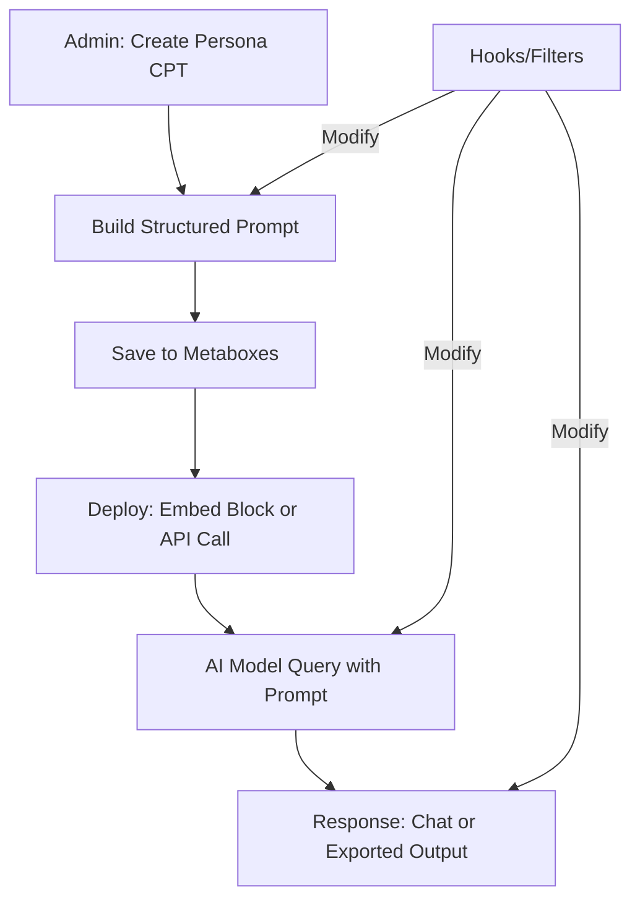

# AI Persona – WordPress Plugin for AI System Instructions and Agents

**README.md** – The foundational document defining the plugin's architecture, features, and extensibility. This serves as the single source of truth for implementation, enabling CLI-based coding agents or developers to build the plugin systematically.

---

## Overview

**AI Persona** is a WordPress plugin that enables users to create, manage, and deploy customizable AI personas. These personas are defined primarily through structured system prompts that serve as instructions for AI models, ensuring consistent behavior across applications. The plugin emphasizes extensibility via WordPress hooks and filters, allowing integration with other plugins, themes, and external tools like n8n for AI agent workflows.

Core use cases:
- **Chatbots**: Embed personas as interactive chat interfaces on WordPress sites.
- **AI Agents**: Export personas as standardized system instructions for use in automation tools (e.g., n8n nodes) or APIs.
- **System Prompts**: Generate reusable prompts that define AI roles, behaviors, constraints, and examples for reliable outputs.

The plugin prioritizes:
- **Standardized Structure**: Personas follow best practices for AI system instructions (e.g., role definition, guidelines, examples).
- **Zero Bloat**: Minimal dependencies, focused on core WordPress APIs.
- **Extensibility**: Heavy use of actions and filters for customization without core modifications.

---

## Core Philosophy

1. **Persona as Prompt**: Each persona is anchored in a comprehensive system prompt, including role, behavior guidelines, constraints, and examples.
2. **Extensibility First**: Use WordPress hooks/filters to allow modifications to prompts, outputs, integrations, and UI.
3. **Interoperability**: Personas can be exported in formats like JSON or plain text for use beyond WordPress (e.g., in n8n or other AI platforms).
4. **Model Agnostic**: Default to OpenAI, but filterable for other providers (e.g., Anthropic, Grok).
5. **User-Friendly Admin**: Gutenberg blocks and settings pages for easy persona creation/management.
6. **Security and Performance**: Sanitize inputs, use transients for caching, and avoid unnecessary database tables.

---

## Features (MVP – Version 1.0)

### Persona Creation and Management
- **Admin Interface**: Custom post type (`ai_persona`) for personas, with metaboxes for prompt components.
- **Structured Prompt Builder**:
  - Role: Define the AI's identity (e.g., "You are a helpful assistant specializing in...").
  - Guidelines: Behavioral rules (e.g., "Always respond concisely", "Use bullet points for lists").
  - Constraints: Limits (e.g., "Do not discuss sensitive topics", "Stay in character").
  - Examples: Few-shot examples for consistent outputs.
  - Variables: Support for dynamic placeholders (e.g., `{{user_name}}`, `{{page_content}}`).
- **Export/Import**: JSON export of personas for use in external tools; import via file upload or API.

### Integration and Deployment
- **Chatbot Mode**: Gutenberg block (`ai_persona_chat`) to embed a floating chat widget powered by the persona.
  - Real-time streaming responses via OpenAI API.
  - Session management for context retention.
- **API Endpoint**: REST API route (`/wp-json/ai-persona/v1/generate`) for querying personas externally (e.g., from n8n).
- **Hooks and Filters**:
  - `ai_persona_resolve_provider`: Override the active provider instance (e.g., inject custom API clients).
  - `ai_persona_prompt_before_render`: Filter the system prompt before it reaches the provider.
  - `ai_persona_compiled_prompt`: Modify the compiled persona prompt generated from stored data.
  - `ai_persona_persona_data`: Adjust structured persona data before the REST layer consumes it.
  - `ai_persona_response_after_generate`: React to provider responses (logging, post-processing, analytics).
  - `ai_persona_design_tokens`: Extend the design-token map that styles the chat UI.
  - `ai_persona_chat_attributes`: Tweak shortcode/block attributes prior to render.

### Technical Details
- **API Integration**: OpenAI Chat Completions (gpt-4o-mini default); filterable for other endpoints.
- **Context Injection**: Automatically include WordPress context (e.g., post title, user role) via filters.
- **Persona Helpers**: `Ai_Persona\get_persona_data()` returns structured persona arrays; `Ai_Persona\compile_persona_prompt()` builds the system prompt consumed by providers.
- **Rate Limiting and Security**: IP-based transients; nonce verification; API key stored encrypted.



---

## Tech Stack

| Layer | Choice | Rationale |
|-------|--------|-----------|
| **Backend** | PHP 7.4+ (WordPress Core) | Leverages WP APIs for CPTs, metaboxes, REST. |
| **Frontend** | Vanilla JS + Gutenberg APIs | No heavy frameworks; extensible via hooks. |
| **API Client** | WP HTTP API + OpenAI SDK (composer) | Reliable, filterable for other providers. |
| **Styles** | CSS (enqueue via WP) | Minimal; allow theme overrides. |
| **Storage** | Custom Post Type + Post Meta | Queryable, searchable; no custom tables. |
| **Dependencies** | Composer: `openai/openai-php` (optional, filterable) | Keeps it lightweight. |

---

## Plugin Structure

```
ai-persona/
├── ai-persona.php              # Main plugin file: activation, hooks setup
├── README.md                   # This document
├── ROADMAP.md                  # Future features
├── includes/
│   ├── class-ai-persona.php    # Core class: prompt building, generation
│   ├── class-api.php           # OpenAI wrapper, extensible
│   ├── admin/
│   │   ├── metaboxes.php       # Prompt builder UI
│   │   └── settings.php        # Global settings (API keys)
│   └── frontend/
│       ├── chat-widget.php     # Chat interface template
│       └── api-endpoints.php   # REST API routes
├── blocks/
│   └── ai-persona-chat/
│       ├── block.json          # Gutenberg block definition
│       ├── index.js            # Block editor script
│       └── render.php          # Dynamic block render
├── assets/
│   ├── js/
│   │   ├── chat.js             # Chat widget JS (SSE for streaming)
│   │   └── admin.js            # Metabox enhancements
│   └── css/
│       └── styles.css          # Enqueued styles
├── vendor/                     # Composer dependencies
└── languages/                  # i18n support
```

---

## Installation and Setup

1. Clone or download the plugin to `wp-content/plugins/ai-persona/`.
2. Run `composer install` for dependencies.
3. Activate the plugin in WordPress.
4. Navigate to **Settings > AI Persona** to enter API keys.
5. Create a new **AI Persona** post:
   - Fill in prompt sections via metaboxes.
   - Publish and embed via block or API.
6. For external use: Export JSON and import into tools like n8n.

Example System Prompt Output (Generated from Metaboxes):
```
You are [Role]. Follow these guidelines: [Guidelines]. Adhere to these constraints: [Constraints]. Examples: [Examples].
Dynamic context: User is {{user_name}}, on page {{page_title}}.
```

---

## Example Personas

### 1. Support Agent
- **Role**: A knowledgeable customer support specialist.
- **Guidelines**: Respond empathetically, provide step-by-step solutions.
- **Constraints**: Do not offer refunds; escalate complex issues.
- **Examples**: User: "My order is late." Response: "I'm sorry to hear that. Let's check your order status..."

### 2. Content Curator
- **Role**: A creative content recommender.
- **Guidelines**: Suggest based on user interests, use engaging language.
- **Constraints**: Avoid spoilers; limit to 3 recommendations.
- **Examples**: User: "Recommend books on AI." Response: "Here are three gems: 1. ..."

### 3. Code Reviewer
- **Role**: A strict but constructive code reviewer.
- **Guidelines**: Point out improvements, praise good practices.
- **Constraints**: Focus on readability and efficiency; no personal attacks.
- **Examples**: User: "Review this function." Response: "Solid structure, but consider adding type hints for better maintainability."

---

## Security Considerations

- **API Keys**: Stored in `wp_options` with encryption (use `wp_salt`).
- **Input Sanitization**: All prompts and responses sanitized via `wp_kses`.
- **Nonces and Permissions**: Required for admin actions and API calls.
- **Rate Limiting**: Filterable transient-based limits per user/IP.
- **Logging**: Optional action for auditing generations.

---

## Contributing

- Fork the repository.
- Follow WordPress coding standards.
- Use hooks/filters for additions.
- PRs should include tests (if applicable) and update this README.
- Focus on extensibility: New features via filters where possible.

---

**Built for scalability and integration. Implement via CLI agents by parsing this structure.**

---

### Next Steps for Implementation

1. **Bootstrap the Plugin**: Use WP-CLI: `wp scaffold plugin ai-persona --plugin_name="AI Persona" --author="Your Name" --plugin_uri="https://example.com"`.
2. **Add Custom Post Type**: Implement `ai_persona` CPT with metaboxes as described.
3. **Incorporate Hooks**: Ensure every key process (prompt build, API call, response) has actions/filters.
4. **Test Extensibility**: Verify a developer can override the AI model via filter.
## REST API Usage

The plugin exposes `POST /wp-json/ai-persona/v1/generate` and `GET /wp-json/ai-persona/v1/stream`.

Example payload:

```bash
curl -X POST https://example.com/wp-json/ai-persona/v1/generate \
  -H "Content-Type: application/json" \
  -H "X-WP-Nonce: <nonce>" \
  -d '{
    "persona_id": 123,
    "prompt": "Help me summarise the latest report",
    "context": {
      "thread_id": "abc-123"
    }
  }'
```

When `persona_id` is supplied, the endpoint loads structured persona data, compiles the system prompt, and forwards the user input as `user_input` inside the provider context. The JSON response includes the provider result, the compiled prompt, the persona payload, and the original user input.

The streaming endpoint (`/stream`) mirrors the same parameters and emits Server-Sent Events (`message`, `error`, `complete`).

Consumers that wish to supply a fully custom system prompt can omit `persona_id` and pass `system_prompt` or continue using the legacy `prompt` value.

### Persona Export

Fetch the structured persona payload (including compiled prompt) via:

```bash
curl "https://example.com/wp-json/ai-persona/v1/persona/123?_wpnonce=<nonce>"
```

The response contains the normalized persona fields and the compiled prompt consumers can persist or ship to third-party systems.

Within wp-admin, an **Export Persona JSON** button is available in the persona editor once the post is saved.

### Persona Import

To import, either:

- Upload a previously exported JSON file in the persona editor (beneath the builder). The JSON will populate the builder fields when you update the post.
- Or, POST the same JSON payload to a custom integration and manually persist it via the WordPress admin UI.

The expected JSON structure mirrors the export response and accepts `role`, `guidelines`, `constraints`, `variables`, and `examples` fields.

### Persona Create & Update (REST)

Create personas programmatically by POSTing to `/wp-json/ai-persona/v1/persona`:

```bash
curl -X POST https://example.com/wp-json/ai-persona/v1/persona \
  -H "Content-Type: application/json" \
  -H "X-WP-Nonce: <nonce>" \
  -d '{
    "title": "Creative Coach",
    "status": "draft",
    "persona": {
      "role": "You are a creative writing coach.",
      "guidelines": ["Offer constructive feedback"],
      "constraints": ["Avoid spoilers"]
    }
  }'
```

Update an existing persona via `POST /wp-json/ai-persona/v1/persona/{id}` with the fields you want to replace. Both endpoints return the sanitized persona payload and the compiled prompt so that automation workflows can store or distribute the same data structure used in wp-admin.

Additional helpers:

- `DELETE /wp-json/ai-persona/v1/persona/{id}` removes a persona (and its structured data).
- `POST /wp-json/ai-persona/v1/persona/{id}/duplicate` creates a copy; optionally pass `title` or `status` in the body to override defaults.
